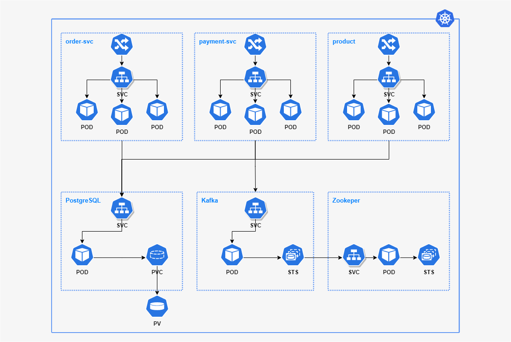
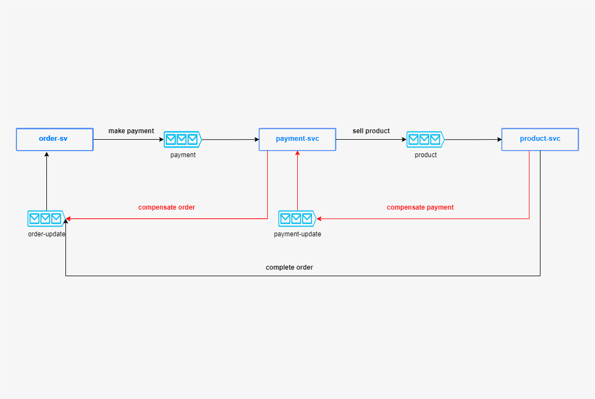

# Quarkus Shopping Microservices

This project offers a complete architecture to deploy Quarkus microservices using native image in a Kubernetes cluster or Docker.
Each microservice has its own database and communication between other microservices is implemented using Kafka as message broker. 
The purpose of this architecture is to use the best Design Patterns for microservice applications. 

# Application explained
This application consists of 3 microservices that work together and implement a full transaction flow for online shopping and also compensation flow to rollback all transactions performed by other microservices when processing an order:

- Order microservice: starting point responsible for creating/processing orders, it is also the start point to communicate with other microservices
- Payment microservice: responsible for payment business
- Product microservice: responsible for controlling products 

# Deploying the application

* Deploying Quarkus native images on Docker for all microservices, tagging/pushing to Docker Hub before configuring Kubernetes cluster:
  - common-service
    ([see common-service/README.md](./common-service/README.md))
  
  - order-service
    ([see order-service/README.md](./order-service/README.md))
    
  - payment-service
    ([see payment-service/README.md](./payment-service/README.md))

  - payment-service
    ([see payment-service/README.md](./payment-service/README.md))

* Kubernetes deployment:
  - Step-by-step to deploy all components of this project in K8s cluster composed by: microservices using native image, database and kafka.

    ([see infrastructure/ks8/README.md](./infrastructure/ks8/README.md))

* Docker deployment:
    - docker-compose to run the all containers that compose the application such as:  microservices using native image, database and kafka.
     
      ([see infrastructure/docker-compose](./infrastructure/docker-compose))
  

# Technologies and Design Patterns in this project:

* Microservices Patterns:
  - Event Sourcing Pattern to recreate state of transactions performed.
  - SAGA Pattern using choreography and combining message exchange between the microservices using KAFKA as message broker.

 

* Quarkus:
  - Native Image
  - Hibernate ORM with Panache Reactive
  - SmallRye Reactive Messaging
  - RESTEasy Reactive to expose the REST endpoints

* Kafka:
  - message broker

* PostgreSQL:
  - database

* Kubernetes:
  - Deployment of all components of this project (PostegreSQL, Kafka, Quarkus native image of each microservice in this application)

# Kubernetes Architecture

# Saga Choreography 
