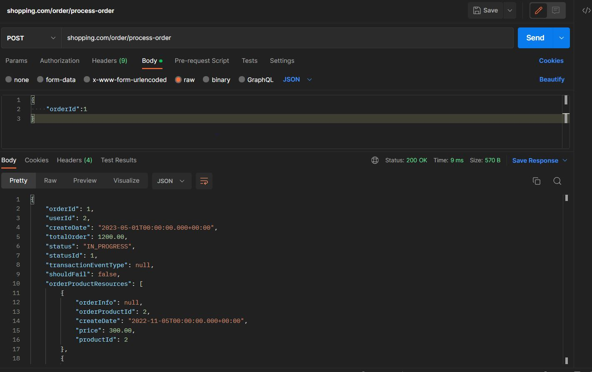

# Kubernetes cluster config:

Tag and push all images to docker hub before doing the steps below! 

General ConfigMap:

```shell script
kubectl apply -f shopping-configmap.yaml
```


Database deployment:
```shell script
cd database
kubectl apply -f shopping-database-secret.yaml
kubectl apply -f shopping-database-claim0-persistentvolume.yaml
kubectl apply -f shopping-database-claim0-persistentvolumeclaim.yaml
kubectl apply -f shopping-database-initial-data-configmap.yaml
kubectl apply -f shopping-database-deployment.yaml
kubectl apply -f shopping-database-ingress.yml

# Port forward if you want to access the database using DBeaver
kubectl port-forward pod/postgresql-99bcfd89b-bgnpj 5432:5432
```

Kafka deployment:
```shell script
cd kafka
kubectl apply -f zookeeper-deployment.yaml
kubectl apply -f kafka-deployment.yaml

# Access the kafka pod to create the topics used by the application:
kubectl exec -it pod/zookeeper-deployment-75f44db564-25sfh -- /bin/bash

kafka-topics --create --topic payment --bootstrap-server kafka-service:9092
kafka-topics --create --topic order-update --bootstrap-server kafka-service:9092
kafka-topics --create --topic product-update --bootstrap-server kafka-service:9092
kafka-topics --create --topic product --bootstrap-server kafka-service:9092
kafka-topics --create --topic payment-update --bootstrap-server kafka-service:9092

#Watching topics to see the messages received:
kafka-console-consumer --bootstrap-server localhost:29092 --topic payment

#List all topics
kafka-topics --list  --bootstrap-server kafka-service:9092
```

Microservices:
```shell script
cd services
kubectl apply -f order-deployment.yaml
kubectl apply -f payment-deployment.yaml
kubectl apply -f product-deployment.yaml

# configuring shopping ingress (nginx ingress must be configured before this step!)
kubectl apply -f shopping-ingress.yaml

# use this command and get the IP in ADDRESS column for shopping-ingress
kubectl get ingress

# edit C:\Windows\System32\drivers\etc\hosts and paste:
172.18.6.70 shopping.com
```


# Application is ready to serve requests:




kubectl useful commands:

```shell script
# watch pod logs 
kubectl logs -f pod/order-svc-55747fdf98-mbrmz
kubectl logs pod/order-55747fdf98-mbrmz --tail=100

# get application ingress deployed in your cluster
kubectl get ingress
```

Ingress controller configuration (optional):

```shell script
# apply nginx ingress
kubectl apply -f https://raw.githubusercontent.com/kubernetes/ingress-nginx/controller-v1.1.2/deploy/static/provider/cloud/deploy.yaml


# get ingress-nginx external IP
kubectl get services -n ingress-nginx
```

Kubernetes cheatsheet:
https://kubernetes.io/docs/reference/kubectl/cheatsheet/